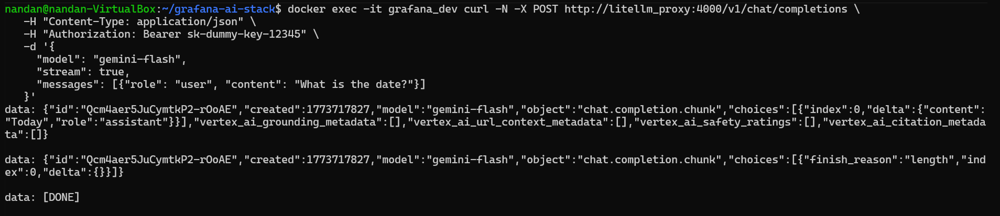
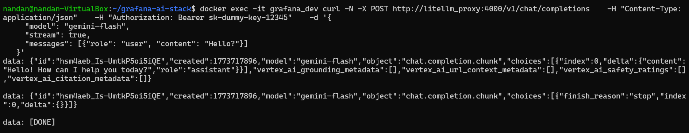

# Grafana Gemini LLM Stack


This project integrates **Google Gemini LLM** with **Grafana V12.4** using **LiteLLM Proxy** on Ubuntu.

---

## 🛠️ Stack Components

| Component | Technology | Role |
| :--- | :--- | :--- |
| **Observability** | Grafana V12.4 | Visualization & AI Plugin Host |
| **AI Gateway** | LiteLLM Proxy | OpenAI-compatible API bridge |
| **LLM** | Google Gemini | Core Language Model |
| **Runtime** | Docker Compose | Container orchestration |

---

## 🚀 Quick Start

1. **Clone the Repo**
2. **Configure Environment:** Create a `.env` file with your `GEMINI_API_KEY`.
3. **Configure Postgres Environment:** Add PostgreSQL credentials and schema to `.env` file.
4. **Deploy:** ```bash
   docker-compose up -d

## 📡 Data Flow

1. **User Prompt**: User enters a query in Grafana.
2. **API Request**: Grafana sends an OpenAI-compatible POST request to LiteLLM.
3. **Database Logging**: LiteLLM logs the request metadata in **PostgreSQL**.
4. **Model Translation**: LiteLLM converts the request to the **Google Gemini** schema.
5. **Inference**: Google Gemini processes the prompt and returns the text.
6. **Visualization**: Grafana displays the AI response to the user.

### 📸 LiteLLM API Verification

#### 1. API Request Call to Gemini Model


#### 2. Gemini Translation Response



## 🏗️ Architecture

```mermaid
graph TD
    User((User)) -->|Port 3000| G[Grafana V12.4]
    
    subgraph Docker_Network [llm-net]
        G -->|OpenAI Protocol: Port 4000| L[LiteLLM Proxy]
        L <-->|Metadata/Caching| P[(PostgreSQL 15)]
    end
    
    L -->|Translation| Gemini[Google Gemini API]
    
    style G fill:#f96,stroke:#333
    style L fill:#5af,stroke:#333
    style P fill:#4b8,stroke:#333
    style Gemini fill:#fff,stroke:#4285F4,stroke-width:2px
